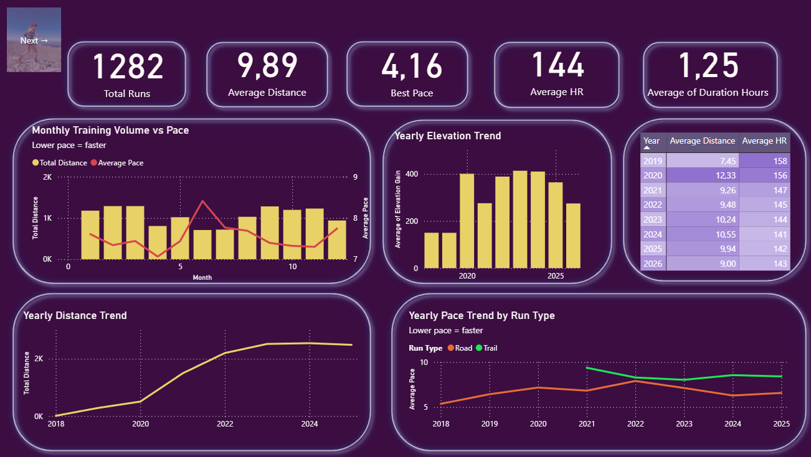
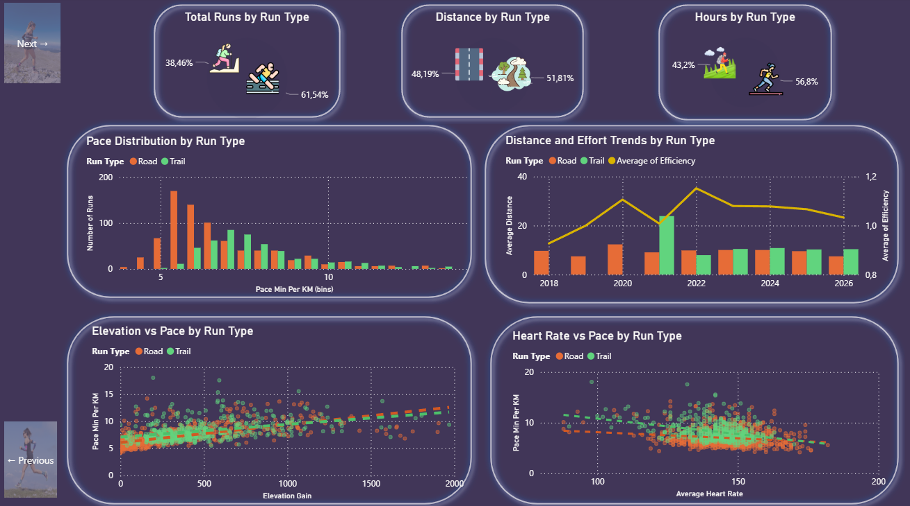
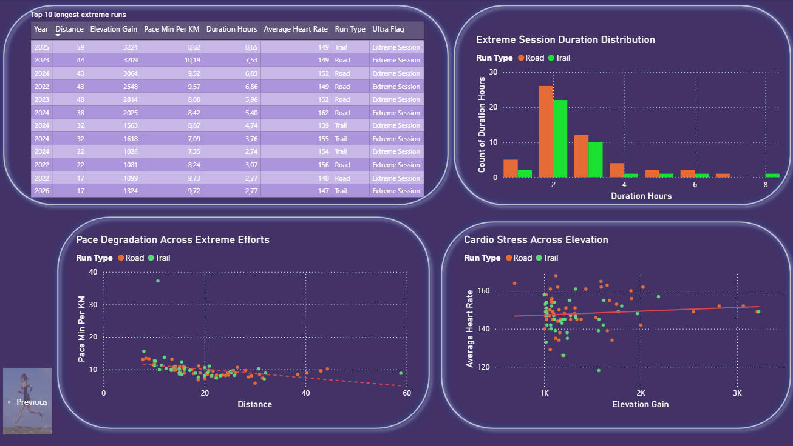

# Road vs Trail Running Analysis  
 
## Project Overview  

This project analyzes running performance data using Python, MySQL, and Power BI,   
with a focus on comparing road and trail running behavior.  
The analysis explores:  

- Running pace trends over time  
- Training volume patterns  
- Terrain impact on performance  
- Cardiovascular stress response  
- Extreme endurance sessions  
- Road vs Trail running differences  

The project combines:  

- Data cleaning and feature engineering in Python  
- SQL-based exploration and validation  
- Interactive dashboarding in Power BI  

## Tools & Technologies  
Python  
Pandas  
MySQL  
Power BI  
VS Code  
Git & GitHub  

## Project Structure  
- [`data/`](data/) — Raw and processed datasets  
- [`src/`](src/) — Python scripts  
- [`sql/`](sql/) — MySQL queries
- [`powerbi/`](powerbi/) — Interactive Power BI dashboard  
- [`images/`](images/) — Dashboard previews and project visuals  

The dataset contains personal running activity data exported from a fitness tracking platform.

Main activity types included:  
Road running, Trail running, Hiking, Ride, Swim, Other training activities  
The analysis focuses only on running-related activities.

## Python Data Processing   

Python was used for:  
Initial data inspection  
Filtering running activities  
Data cleaning  
Feature engineering  
Performance metric creation  
Exporting cleaned datasets  

## Key Features Created  

Pace Min Per KM  
Calculated running pace in minutes per kilometer.

Run Type  
Classified activities into:  
-Road   
-Trail  

Efficiency  
Custom pace-heart rate efficiency proxy used to compare cardiovascular effort across terrains.  

Ultra Flag  
Classification used to identify extreme endurance sessions:  
Distance > 30 km  
OR  
Elevation Gain > 1000 m  
This classification does not necessarily indicate an official ultramarathon. It represents high-stress endurance sessions.  

## SQL Analysis  

MySQL was used for:  

- Data validation  
- Aggregations  
- Filtering  
- Comparative analysis  
- Exploratory queries  

Examples:  
Average pace by year  
Road vs Trail comparisons  
Extreme session analysis  
Distance and elevation summaries  

## Power BI Dashboard  

The Power BI dashboard is divided into three analytical sections.  

## Page 1 — General Running Overview  

  

This section provides a high-level overview of the runner profile.  

Main KPIs  
- Total Runs  
- Average Distance     
- Best Pace  
- Average Heart Rate  
- Average of Duration Hours
Main Visuals
- Monthly Training Volume vs Pace  
- Yearly Pace Trend by Run Type  
- Yearly HR & Distance  
- Yearly Distance Trend  
- Average Elevation by Run Type  

Key Insights  
- Training volume increased significantly over time  
- Trail sessions generally produce slower pace values due to terrain difficulty  
- Running behavior shifted from speed-focused training toward endurance-oriented efforts  
- Pace remained relatively stable despite higher training volume
  
##Page 2 — Trail vs Road Deep Dive  

  

This section focuses on comparative terrain analysis.  

The goal is to understand how performance changes depending on terrain type.  

Main Visuals  
Pace Distribution by Run Type  
Histogram showing how pace variability differs between Road and Trail running.  

Elevation vs Pace  
Scatter plot analyzing the relationship between terrain difficulty and running pace.   

Heart Rate vs Pace  
Scatter plot examining physiological response during different running conditions.

Distance and Effort Trends by Run Type  
Combination chart comparing endurance load and effort over time.  

Key Insights
- Trail running creates higher pace variability  
- Elevation significantly affects running pace  
- Terrain difficulty influences performance more strongly than distance alone  
- Trail sessions require greater cardiovascular effort for comparable pace ranges
 
## Page 3 — Ultra / Extreme Trail Analysis  

  

This section focuses on high-endurance and high-elevation sessions.  

It explores how extreme terrain and long-duration efforts affect performance.  

Main Visuals  
Extreme Endurance Sessions  
Table showing the longest and most demanding runs.  

Extreme Session Duration Distribution  
Distribution of long-duration endurance sessions.  

Distance vs Pace in Extreme Sessions  
Scatter plot analyzing fatigue accumulation and pace behavior.  

Elevation Gain vs Heart Rate  
Scatter plot examining cardiovascular stress during extreme elevation efforts.  

Key Insights  
- Extreme endurance stress is not determined by distance alone 
- High elevation can create significant physiological demand even at shorter distances  
- Trail efforts produce longer sustained stress exposure  
- Terrain severity may influence pace more strongly than distance itself  
- Cardiovascular response is influenced by multiple factors, not elevation alone

Analytical Focus  

The project emphasizes:  
- Performance analysis  
- Endurance behavior  
- Terrain impact  
- Physiological stress interpretation  
- Feature engineering  
- Multi-page analytical storytelling  

Instead of focusing only on summary statistics, the dashboard explores relationships between:

Distance  
Elevation  
Pace  
Heart Rate  
Duration  
Terrain type  
Future Improvements  

Potential future additions:  

Weather impact analysis  
Temperature vs pace analysis  
HR zone analysis  
Fatigue trend modeling  

## Author
Georgios Konstantopoulos
